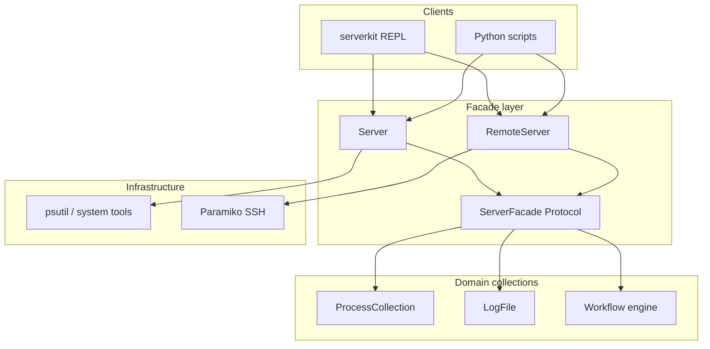

# ServerKit

**A Python design exercise: Linux server resources as fluent, chainable objects.**

ServerKit wraps host inspection (processes, memory, logs, disk, services, …) behind a `Server` facade, collection filters, and persisted workflows. It ships as a library and a small REPL — not as a production orchestration tool.

[](https://pypi.org/project/serverkit/)
[](https://pypi.org/project/serverkit/)
[](LICENSE)

```bash
pip install "serverkit[rich]"
serverkit --version
```

**Docs:** [User guide](docs/USER_GUIDE.md) · [Examples](examples/) · [PyPI](https://pypi.org/project/serverkit/)

---

## Why we Built This

We wanted to practice **object-oriented API design** on a real domain: Linux server operations.

Most admin work is expressed as shell pipelines and one-off scripts. ServerKit asks a different question: *what if processes, logs, and memory were typed collections with fluent filters and explicit terminal methods?*

**Goals**

- Model host resources as **composable objects**, not string commands
- Keep **local and remote** behind the same facade (`Server` / `RemoteServer`)
- Persist multi-step checks as **versioned JSON workflows**
- Expose the SDK through a **thin REPL** for fast feedback

**Non-goals**

- Replacing Ansible, Fabric, Kubernetes, or production incident tooling
- Running arbitrary shell from an LLM (the optional AI layer routes to SDK calls only)

This repository is a **portfolio piece** demonstrating API shape, abstraction boundaries, and developer experience — not a claim to production-scale ops coverage.

---

## Live Demo

~75s walkthrough: REPL → memory → process filters → save workflow → run locally → run on a remote host via SSH.

<!-- Replace XXXXXX after recording — see docs/demo/DEMO.md -->
[](https://asciinema.org/a/XXXXXX)

You'll see:

1. Host memory and process collections queried through the REPL
2. A workflow composed in one line and saved to `~/.serverkit/workflows/`
3. The same workflow executed on a remote host without changing the JSON

Recording steps: [docs/demo/DEMO.md](docs/demo/DEMO.md)

---

## Architecture



| Layer | Responsibility |
|-------|----------------|
| **Facade** | `Server` / `RemoteServer` — single entry point per host ([`serverkit/core/server.py`](serverkit/core/server.py), [`serverkit/core/protocol.py`](serverkit/core/protocol.py)) |
| **Collections** | Eager snapshots + fluent filters + terminal `.summarize()` / `.display()` |
| **Workflows** | JSON `schema_version: 2` pipelines; `_server` injected at runtime for local or remote |
| **Shell** | Pattern-matched REPL → SDK calls ([`serverkit/shell/parser.py`](serverkit/shell/parser.py)) |

---

## Key Design Decisions

| Decision | Rationale |
|----------|-----------|
| **Facade + Protocol** | `ServerFacade` lets workflows and tests treat local and SSH targets uniformly without duplicating step logic. |
| **Fluent collections** | Filters apply eagerly on in-memory snapshots; chains read left-to-right; terminal methods make execution explicit. |
| **Workflow as composite** | Steps are registered strategies (`StepFactory`); executor walks a shared context dict — easy to add step types without changing the REPL. |
| **Thin REPL** | Parser maps strings to SDK calls; no embedded Python eval — keeps shell and library boundaries clear. |
| **Optional extras** | `rich`, `remote`, `docker`, `ai` as install extras — core SDK stays small; `OptionalDependencyError` guides installs. |

**Tradeoffs we accepted**

- Eager snapshots over streaming (simpler mental model; fine for inspection, not for log tailing at scale)
- REPL coverage is a **subset** of the SDK — scripts are the fully composable surface
- Remote parity is broad but not exhaustive (workflows are authored locally, executed with remote `_server`)

---

## Example Usage

**REPL** — chains map directly to SDK calls:

```text
memory
processes().memory_above(200).sort_by_memory().display()
workflow("audit").processes().memory_above(300).summarize().save()
run audit
```

**Python** — same objects, scriptable:

```python
from serverkit import Server

server = Server()
print(server.processes().memory_above(500).sort_by_memory().summarize())
server.workflow("audit").processes().memory_above(500).summarize().save()
server.run("audit")
```

**Remote** — `Server.connect()` returns a facade that implements the same protocol:

```python
with Server.connect("host", user="deploy", key_path="~/.ssh/id_ed25519") as remote:
    remote.run("audit")  # workflow JSON local; execution uses remote _server
```

More: [examples/](examples/) · [memory_audit.py](examples/memory_audit.py) · [remote_audit.py](examples/remote_audit.py)

---

## Install

```bash
pip install "serverkit[rich]"    # recommended: SDK + REPL + tables
pip install "serverkit[all]"     # + remote, docker, ai
serverkit                        # interactive shell
```

Config is created at `~/.serverkit/config.json` on first launch. Optional extras, AI, and full REPL reference: [User guide](docs/USER_GUIDE.md).

---

## Documentation

| Guide | Description |
|-------|-------------|
| [User guide](docs/USER_GUIDE.md) | Mental model, SDK, REPL, remote, AI, troubleshooting |
| [Examples](examples/) | Runnable sample scripts |
---

## Team

- Anoushka Awasthi ([GitHub](https://github.com/anoushkawasthi))
- Aahil Khan

## Development

```bash
python -m venv .venv && source .venv/bin/activate
pip install -e ".[dev]"
pytest
```

Integration tests (live OS): `pytest -m integration`

---

## License

MIT — see [LICENSE](LICENSE).
